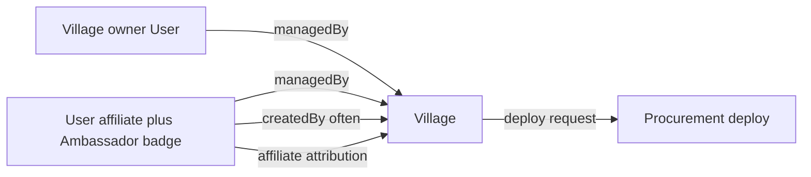

# Closer Ambassador Program — Feature Requirements

Source: Ambassador Guide (Bart, Nov 2025) + product constraints below. This is a **requirements** document for product/engineering.

## Product constraints (locked)

- **Ambassadors are users with affiliate status.** Signing up as Ambassador sets `user.affiliate` (existing field). Rewards, dashboards, and commission tiers reuse `AffiliateConfig` (stays / events / subscriptions / token sales / products). Do **not** build a parallel 5%/10% commission engine; guide percentages are commercial narrative—actual rates are admin-configurable affiliate rates.
- **Badge / role:** Ambassadors are identifiable via affiliate status plus a visible **Ambassador** badge (and optionally `roles` containing `ambassador` for filtering/admin). UI copy on closer.earth can say “Ambassador” while backend storage remains affiliate-backed.
- **Village entity = `Village`** via base CRUD `/village` ([closer-api#493](https://github.com/closerdao/closer-api/pull/493), merged). UI must not overload volunteer `Project`.
- **Edit ACL:** Ambassador and village owner are both in `Village.managedBy` (baseFields). Creators/managers may PATCH village fields.
- **Deployments via Procurement.** Tier 1 has **€0 setup**. Customers subscribe at **€49/month (first month free)**; then Ambassador or customer **requests app deployment**. Deploy is **human-gated initially** (Procurement app), automated later.

## Current baseline

| Area | Today |
|------|--------|
| Ambassador product | Affiliate + friend-referral exist; Ambassador branding on closer.earth |
| Map | API-backed `/village` with static pin fallback |
| Villages API | Base CRUD `/village` (merged closer-api#493) |
| Deployments | Procurement app (human-gated queue in closer.earth admin) |
| Rewards | Affiliate dashboards under `/affiliate`, `/settings/affiliate`, `/dashboard/affiliate` |

---

## Domain model

**Village** — name, description, tags, country, website, appUrl, coords, status, capacity, amenities, contact, closer flag + `managedBy` / `createdBy` from baseFields.

**Product fields on Village:**

- `referredBy` / `ambassadorId` — affiliate attribution after the village is live on Closer
- Project manager profile fields (`projectManager`)
- Verification / resonance badge (`unverified` | `pending` | `verified` | `resonant`)
- Soft-fit metadata (`criteria`) for Appendix A
- `onboardingStatus`, `platformSubscription`, `deployRequest` for Tier 0→1

---

## Personas & permissions

| Actor | Can |
|-------|-----|
| Prospect Ambassador | Apply / self-enable affiliate → Ambassador branding |
| Ambassador | Add Villages; edit those in their `managedBy`; invite owners; request deploy after customer subscribe; see affiliate earnings for attributed villages |
| Village owner | Accept invite; edit own Village; subscribe (€49/mo, first month free); request deploy; complete project + PM info |
| Ambassador Coordinator / admin | Approve Ambassadors if gated; pre-assess fit; assign/remove `managedBy`; set verification badge; process human-gated deploy queue via Procurement |
| Public | View map + public village profiles |

---

## Phase 1 — MVP

### F1. Ambassador page + profiles
### F2. API-backed regenerative map (`GET /village`)
### F3. Add & manage villages on the map (Tier 0) — `POST/PATCH /village`
### F4. Attribution & rewards (affiliate reuse via `referredBy`)
### F5. Activation / ops tooling (lightweight)

## Phase 2 — Convert map villages to Closer tenants

### F6. Tier 0 → Tier 1 handoff

**Commercial (locked)**

- **Setup fee:** €0
- **Platform subscription:** €49/month, **first month free**
- **Product included once live:** bookings, events, content
- **Deploy gate:** After subscription signup, Ambassador or customer **requests deployment**. Fulfillment is **human-gated via Procurement** at first; eventually automated.

Workflow: `map_only` → `pre_assessed` → `subscribed` → `deploy_requested` → `deploying` → `live` (`closer: true`).

### F7. Tier 2 (optional tokenization)
### F8. Network curator map embed (`/map/embed`)

## Phase 3 — Network effects

### F9–F12. Shared events/content, passports, cross-village subscriptions, OASA metrics

See [ambassador-phase3-network-epics.md](./ambassador-phase3-network-epics.md).

---

## Explicit non-goals

- New commission system duplicating affiliate
- Rebuilding Procurement / deploy automation in closer-ui MVP
- Using volunteer `Project` model as villages
- Modeling deployment tenants outside Procurement in this UI
- €1k Tier 1 setup fee (superseded: €0 setup + €49/mo)

---

## UI surfaces (closer.earth)

| Surface | Purpose |
|---------|---------|
| `/ambassadors` | Join program |
| `/ambassadors/[slug]` | Public Ambassador profile |
| `/map` + homepage map | Discover Villages |
| `/map/embed` | Curator embed shell |
| `/villages/[slug]` | Public + edit (managers) |
| `/settings/affiliate` | Earnings (existing) |
| `/dashboard/deploy-queue` | Human-gated Procurement handoff |

Types: `packages/closer/types/village.ts`. API: base CRUD `/village`.

## API reference

See [village-api.md](./village-api.md). Merged backend: [closer-api#493](https://github.com/closerdao/closer-api/pull/493).
