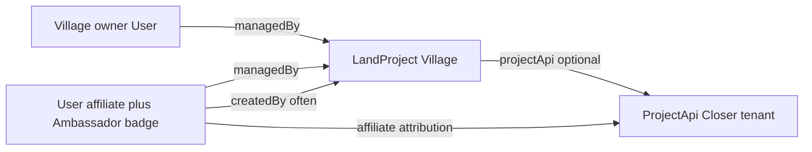

# Closer Ambassador Program — Feature Requirements

Source: Ambassador Guide (Bart, Nov 2025) + product constraints below. This is a **requirements** document for product/engineering, not an implementation plan.

## Product constraints (locked)

- **Ambassadors are users with affiliate status.** Signing up as Ambassador sets `user.affiliate` (existing field). Rewards, dashboards, and commission tiers reuse `[AffiliateConfig](packages/closer/types/api.ts)` (stays / events / subscriptions / token sales / products). Do **not** build a parallel 5%/10% commission engine; guide percentages are commercial narrative—actual rates are admin-configurable affiliate rates.
- **Badge / role:** Ambassadors are identifiable via affiliate status plus a visible **Ambassador** badge (and optionally `roles` containing `ambassador` for filtering/admin). UI copy on closer.earth can say “Ambassador” while backend storage remains affiliate-backed.
- **Village entity = `LandProject`** from open MR [closer-api#290](https://github.com/closerdao/closer-api/pull/290) (`LandProject` + `ProjectApi`, geo search, link/unlink). UI must not overload volunteer `[Project](packages/closer/types/api.ts)`.
- **Edit ACL:** Ambassador and village owner are both in `LandProject.managedBy` (already on `baseFields`). Creators/managers may PATCH land-project fields and link/unlink `ProjectApi`.
- **1-click / procurement already exists.** Tier 1 has **€0 setup**. Customers subscribe at **€49/month (first month free)**; then Ambassador or customer **requests app deployment**. Deploy is **human-gated initially**, automated later — reuse existing procurement/deploy path; do not rebuild it.

## Current baseline

| Area                  | Today                                                                                     |
| --------------------- | ----------------------------------------------------------------------------------------- |
| Ambassador product    | None (affiliate + friend-referral exist)                                                  |
| Map                   | Static Leaflet data in `[apps/closer/components/Map.jsx](apps/closer/components/Map.jsx)` |
| Land projects API     | Open PR #290 — not merged / not consumed by UI                                            |
| Village onboarding UX | Marketing CTA only on closer.earth                                                        |
| Rewards               | Affiliate dashboards under `/affiliate`, `/settings/affiliate`, `/dashboard/affiliate`    |

---

## Domain model

**LandProject (Village)** — fields from PR #290 (name, description, tags, country, website, appUrl, apiUrl, coords, status, capacity, amenities, contact, closer flag, projectApi) + `managedBy` / `createdBy` from baseFields.

**Required product additions on top of PR (API and/or UI conventions):**

- `referredBy` / `ambassadorId` on LandProject (or ProjectApi) so village-level revenue can attribute to the Ambassador’s affiliate account after the tenant is live.
- Project manager profile fields (name, email, role) — either on `contact` or a nested `managers[]`.
- Verification / resonance badge state (enum: `unverified` | `pending` | `verified` | `resonant`) for map display.
- Soft-fit metadata for criteria (people range, rooms, monthly volume estimate, regeneration focus, web3 openness) — used in pre-assessment, not necessarily public.

---

## Personas & permissions

| Actor                          | Can                                                                                                              |
| ------------------------------ | ---------------------------------------------------------------------------------------------------------------- |
| Prospect Ambassador            | Apply / self-enable affiliate → Ambassador branding                                                              |
| Ambassador                     | Add LandProjects; edit those in their `managedBy`; invite owners; request deploy after customer subscribe; see affiliate earnings for attributed projects |
| Village owner                  | Accept invite; edit own LandProject; subscribe (€49/mo, first month free); request deploy; complete project + PM info |
| Ambassador Coordinator / admin | Approve Ambassadors if gated; pre-assess fit; assign/remove `managedBy`; set verification badge; process human-gated deploy queue; link ProjectApi |
| Public                         | View map + public village profiles                                                                               |

---

## Phase 1 — MVP (short-term from guide)

### F1. Ambassador page + profiles

**Requirements**

- Public **Ambassador** landing on closer.earth (program overview, criteria summary, CTA). Prefer rebranding/wrapping existing `[/affiliate](packages/closer/pages/affiliate/index.tsx)` for closer.earth **or** `/ambassadors` that enables the same `user.affiliate` path.
- On join: set `affiliate: new Date()`; show Ambassador badge on profile; route to affiliate dashboard (earnings, link builder).
- Ambassador profile page: bio, photo, list of LandProjects they manage/referred, contact CTA.
- Ambassador Coordinator can list Ambassadors (filter users with affiliate / ambassador role).

**Acceptance**

- New Ambassador appears in affiliate settings and earns per existing AffiliateConfig once attribution fires.
- Badge visible on public profile and map “added by” attribution.

### F2. API-backed regenerative map

**Requirements**

- Replace hardcoded map array with base CRUD `GET /village` (filters via `where` / formatSearch: tags, country, status, closer).
- Map UX: clean pins, filters (tags, country, Closer-live vs map-only), popup with name, short description, tags, website, verification badge, link to village detail.
- Seed from existing static list / PR `data/projects.json` so current closer.earth pins survive migration.
- Dedicated `/map` (or keep homepage embed + full page).

**Acceptance**

- No client-hardcoded project list for production data; Ambassadors’ adds appear after refresh without deploy.

### F3. Add & manage villages on the map (Tier 0)

**Requirements**

- Authenticated Ambassador flow: create LandProject (coords pick/search, required fields, criteria checklist from Appendix A).
- On create: `createdBy` = Ambassador; `managedBy` includes Ambassador (and later owner).
- Invite village owner (email magic link / claim token): on accept, owner user added to `managedBy`; owner can edit project + PM info.
- Owner/Ambassador edit form for public fields; Coordinator can set verification badge.
- Pre-assessment checklist UI (hard + soft criteria from Appendix A) — stored or noted for AC; gate “invite to intro call” CTA.

**Appendix A — hard criteria (product validation rules)**

- Land-based, real land, people on land, somewhat operational
- ~10–500 people (current or planned); below 10 not a fit
- 10+ rooms (available or planned)
- Not techno-phobic

**Soft criteria (signals, not hard blocks)**

- €5k–€20k monthly transaction volume ideal
- Ecological regeneration & regenerative culture
- Decentralization / web3 openness (tokens, proof of presence, proof of sweat)

**Acceptance**

- Ambassador can add a pin; owner can edit without admin; non-managers cannot PATCH.

### F4. Attribution & rewards (affiliate reuse)

**Requirements**

- When a map village converts to a Closer tenant (`ProjectApi` linked), store Ambassador attribution (`referredBy` = Ambassador user id).
- Tenant activity continues to pay Ambassador via **existing affiliate commission pipeline** (same dashboards/payouts).
- MVP may keep manual reconciliation notes in admin if cross-tenant charge attribution is incomplete; product must still record the Ambassador↔LandProject↔ProjectApi link.

**Out of scope for Phase 1:** separate Level-2 “+5% ongoing” ledger; treat Level 2 as operational expectation + same affiliate rates unless AffiliateConfig is later extended.

### F5. Activation / ops tooling (lightweight)

**Requirements**

- AC onboarding checklist (read guide, join Telegram — external; in-app: enable Ambassador, shortlist candidates).
- Admin: assign/remove managers on LandProject; mark verification; filter by status.

---

## Phase 2 — Convert map villages to Closer tenants

### F6. Tier 0 → Tier 1 handoff

**Commercial (locked)**

- **Setup fee:** €0 (enabled by existing 1-click / procurement deploy).
- **Platform subscription:** €49/month, **first month free**.
- **Product included once live:** Tier 1 basics — bookings, events, content (homepage).
- **Deploy gate:** After subscription signup (trial started), Ambassador **or** village customer can **request deployment**. Fulfillment is **human-gated at first** (ops/AC approves and runs procurement deploy); **eventually automated**.

**Requirements**

- From village detail: path to start Closer — subscribe → request deploy (fit projects; pre-assessment still applies where useful).
- Workflow states: `map_only` → `pre_assessed` → `subscribed` (trial/active €49 plan) → `deploy_requested` → `deploying` (human or auto) → `live` (map `closer: true`, link `projectApi`). Optional ops states (`intro_scheduled`, notes) remain available but are not required before subscribe.
- **Subscribe:** customer (village owner) completes €49/mo signup with first month free; Ambassador attribution attached so subscription commissions flow via existing affiliate rates.
- **Request deployment:** CTA available to managers (`managedBy`: Ambassador and/or owner) only when subscription is active or in free trial; creates a deploy request (status + timestamp + requester); notifies ops for human gate.
- Hand off fulfillment to **existing procurement / deploy** (no new deploy product). When automation lands, same request object becomes the trigger.
- After deploy: link LandProject ↔ ProjectApi (`link-project-api`); show live badge on map.

**Acceptance**

- No €1k setup charge in Tier 1 flows or copy.
- Deploy request is blocked without subscription/trial.
- Ambassador and customer can both submit deploy request; ops can see and complete the queue until automation exists.

### F7. Tier 2 (optional tokenization)

**Requirements**

- Path from live Tier 1 village to Tier 2 (€5k setup narrative): token process, launch. Reuse existing token-sale / financed flows on the tenant; federation hub records status on LandProject/ProjectApi.
- Ambassador continues to earn via affiliate rates on token sales (`tokenSaleCommissionPercent` / financed variant).

### F8. Network curator map embed (mid-term guide)

**Requirements**

- Embeddable map/widget or public API for curators (e.g. Agartha): filterable LandProjects, permissioned editing for curator-managed sets if needed.
- Document why Closer vs Notion: roles, searchable, scalable, badges (from guide Q&A).

---

## Phase 3 — Network effects (long-term guide)

### F9. Shared events & content overview

- Cross-tenant discovery of events/content from linked ProjectApis (federation read APIs). Depends on passport/federation work in `[closer-v4-passport-federation.md](apps/closer/data/closer-v4-passport-federation.md)`.

### F10. Passports (Agartha-style networks)

- Pool villages in a network; curated values; priority access / discounts; token exchange relevance at scale. Spec already exists; Ambassador program supplies the village graph and trust badges.

### F11. Cross-village subscriptions (Appendix B — inspirational)

- e.g. €50/mo network passport; revenue split sketch 70% villages / 15% curator / 10% Closer / 5% future fund. **Not MVP.** Productize only after passport + multi-tenant billing exist.

### F12. OASA Principles metrics

- Per-project impact metrics; good performance → benefits (e.g. reduced tx fee). Fundraising/impact storytelling. Later.

---

## Explicit non-goals

- New commission system duplicating affiliate.
- Rebuilding 1-click deploy / procurement.
- Using volunteer `Project` model as villages.
- Fully automating Telegram/AC human process in MVP.
- Fully automating tenant deploy in MVP (human-gated deploy queue is required first).
- Legal entity setup as a Closer product feature (open Q in guide — out of scope unless separately scoped).
- €1k Tier 1 setup fee (superseded: €0 setup + €49/mo).

---

## UI surfaces (closer.earth / apps/closer)

| Surface                                       | Purpose                                 |
| --------------------------------------------- | --------------------------------------- |
| `/ambassadors` or branded `/affiliate`        | Join program                            |
| `/ambassadors/[slug]`                         | Public Ambassador profile               |
| `/map` + homepage map                         | Discover LandProjects                   |
| `/villages/[slug]` | Public + edit (managers) |
| `/settings/affiliate`                         | Earnings (existing)                     |
| Admin land-project tools                      | Verification, managers, link ProjectApi |

Types live in `packages/closer/types` (e.g. `landProject.ts`); API client against closer-api hub.

---

## Open product decisions (defaults assumed)

1. **Self-serve vs AC-gated Ambassador join** — Default: self-serve affiliate enablement with Ambassador branding; AC can revoke.
2. **Guide 5%+5% vs AffiliateConfig rates** — Default: AffiliateConfig is source of truth; marketing copy updated to match configurable rates.
3. **Coords order** — PR model validates coords as `[lng-ish, lat-ish]` inconsistently vs Leaflet `[lat, lng]` in UI seed; normalize in API/UI contract during implementation.
4. **Verification badge meaning** — Default: Coordinator-set; optional later “Ambassador visited site.”

---

## Suggested delivery order

1. Merge/stabilize [closer-api#290](https://github.com/closerdao/closer-api/pull/290); confirm `managedBy` PATCH permissions for managers.
2. UI types + map read from API; migrate static pins.
3. Ambassador = affiliate + badge + landing/profile.
4. Create/edit LandProject + managedBy invite + criteria checklist.
5. Attribution field + Tier 0→1 status machine: €49 subscribe (1st month free) → deploy request (human gate) → link ProjectApi.
6. Automate deploy fulfillment later (same request object).
7. Curator embed → federation/passport/network subscriptions as separate epics.

## API contract notes (closer-api)

Depends on [closer-api#290](https://github.com/closerdao/closer-api/pull/290) (`LandProject`, `ProjectApi`, geo search, link/unlink). UI types live in `packages/closer/types/landProject.ts`.

### Already in PR #290

- `LandProject` fields: name, closer, description, tags, country, website, appUrl, apiUrl, coords, status, capacity, amenities, contact, projectApi
- `managedBy` / `createdBy` via `baseFields` — managers may edit and link ProjectApi
- Routes: base CRUD on `/village` (`POST`/`GET`/`PATCH`/`DELETE`); link tenant via `PATCH /village/:id` `{ projectApi }`

### Required API additions for this program

Add editable fields on `LandProject` (and/or `ProjectApi` where noted):

| Field | Purpose |
|-------|---------|
| `referredBy` / `ambassadorId` | Affiliate attribution to Ambassador user |
| `verificationBadge` | `unverified` \| `pending` \| `verified` \| `resonant` |
| `onboardingStatus` | `map_only` → `pre_assessed` → `subscribed` → `deploy_requested` → `deploying` → `live` |
| `criteria` | Appendix A hard/soft fit metadata |
| `projectManager` | `{ name, email, role }` |
| `deployRequest` | `{ status, requestedAt, requestedBy, notes, processedAt, processedBy }` |
| `platformSubscription` | `{ status, planPriceEur, trialStartedAt, subscribedAt, stripeSubscriptionId }` |

Permissions:

- PATCH allowed for `createdBy` and any id in `managedBy`
- Deploy queue transitions (`deploying`, `live`, verification badge) for admin / affiliate-manager / Ambassador Coordinator
- Coords contract: seed data and UI use Leaflet `[lat, lng]`; normalize consistently in API validation

Until these fields ship, the UI still posts/patches them where possible; unknown fields may be ignored by older API builds. Map falls back to static pins when `GET /village` is empty/unavailable.
