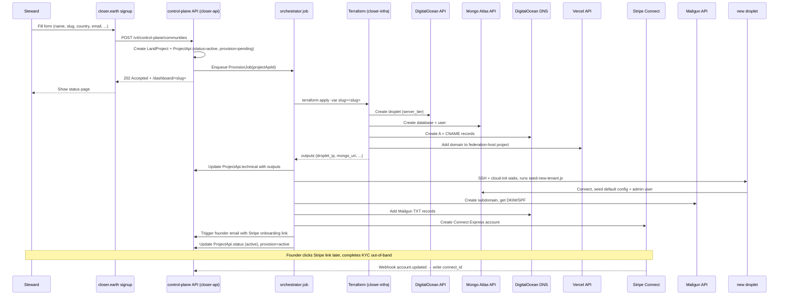
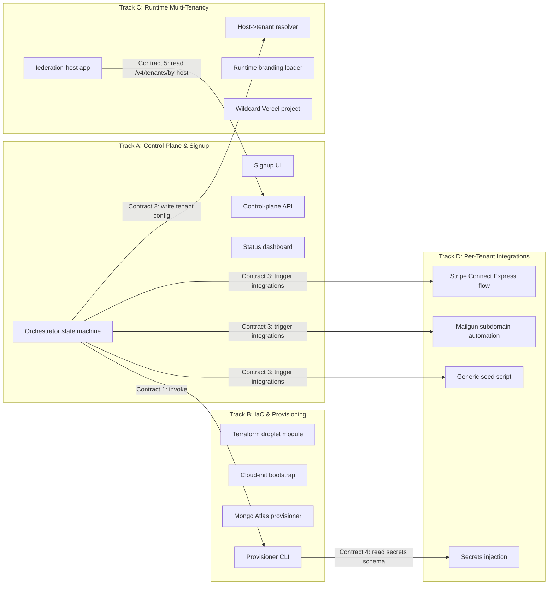

# feat: One-Click Community Deployments (Strategy Track 1)

> **Target repos.** This plan spans `closer-ui` (the document's home), `closer-api`, and a new `closer-infra` repo that does not yet exist. Each `**Files:**` block is prefixed with the repo it lives in. Where a path is unprefixed it means `closer-ui` (this repo).

> **Status quo on which this plan builds.** Federated isolation: each community runs on its own DigitalOcean droplet, its own MongoDB, its own Vercel app, its own Stripe Connect account, its own subdomain. Today this is a 15-step manual runbook reconstructed from `closer-api/deploy.fish`, `closer-api/SETUP.md`, `closer-ui/MIGRATE_PLATFORM_STRIPE_ACCOUNT.md`, and the `apps/<community>/` folders in `closer-ui` (`tdf`, `earthbound`, `moos`, `lios`, `foz`, `per-auset`, `closer`). The goal is to keep federated isolation as the topology while replacing the runbook with an orchestrated, self-serve flow that takes minutes instead of days.

---

## Summary

Build the federated-isolation one-click deployment pipeline so any prospective land-project steward can sign up on `closer.earth`, answer a structured form, and receive a fully provisioned Closer instance (FE + API + DB + DNS + payments rails + seed data) at `<slug>.closer.earth` within ~20 minutes, with no manual ops work for the central team.

The deliverable is a **control plane** at `closer.earth` that orchestrates provisioning, **infrastructure-as-code** modules for the underlying droplet/Mongo/DNS layer, **runtime multi-tenancy** in `closer-ui` so a single deployable image can be configured per host rather than rebuilt per community, and **per-tenant integration automation** (Stripe Connect, Mailgun subdomain, secrets injection, seed data). PR #290 and PR #330 on `closer-api` already deliver the registry models (`LandProject`, `ProjectApi`), Lamport-signed instance identity, and DNS provisioning via DigitalOcean — this plan consumes those primitives and adds the missing 60%.

Sequencing is structured as one prerequisite track (Track 0: PR hardening) followed by four maximally parallel tracks (A: Control Plane & Signup, B: IaC & Provisioning, C: Runtime Multi-Tenancy, D: Per-Tenant Integrations). Each track has a single owner among 3–4 part-time engineers and hard interface contracts so engineers can ship without waiting on others.

---

## Problem Frame

Today every new Closer community deployment is a bespoke, multi-day effort that the core team performs by hand. The cost is high enough that adding a community is treated as a project. The strategy doc commits to federation as the operating model — communities running their own sovereign instances on a shared protocol — but the federation cannot grow if onboarding is gated by central-team capacity. STRATEGY.md Track 1 is the explicit commitment to fix this in the next 0–6 months.

The current state spans four interlocking forms of friction:

1. **Infrastructure is hand-provisioned.** DigitalOcean droplet, MongoDB, DNS, SSL, Vercel project, secrets — all created by humans clicking dashboards. `closer-api/deploy.fish` is 3 lines of rsync to a hardcoded `crocodile` host. No Terraform, Ansible, Pulumi, Docker, or CI-driven deploy exists.
2. **The FE assumes one app per tenant.** `closer-ui` is a Turborepo with a folder per community (`apps/tdf`, `apps/moos`, etc.) and ~68 `NEXT_PUBLIC_*` env vars baked into each build, including 17 feature flags. Adding a community means adding a folder, populating env vars, and standing up a Vercel project.
3. **Per-tenant integrations are not API-driven.** Each community needs a Stripe Connect account (the 14-step `MIGRATE_PLATFORM_STRIPE_ACCOUNT.md` shows the pain), a Firebase project, a Mailgun domain, Twilio credentials, web3 keys. None of this is automated.
4. **Federation primitives exist but are unmerged.** PR #290 (LandProject + ProjectApi registry) and PR #330 (Passport, Lamport signing, DigitalOcean DNS, instance self-registration) provide the data model and identity layer the orchestrator needs to consume — but they have known security issues (HMAC vuln, NoSQL injection risk, /tmp key index, hardcoded credentials) and are not merged.

A part-time engineering team of 3–4 people cannot afford to serialize this work. The plan must allow each engineer to take a track and ship without waiting.

---

## Goals

- A founding steward can complete signup on `closer.earth` and reach a working Closer instance (FE loads, admin can log in, listings page renders) at `<slug>.closer.earth` in ≤30 minutes wall-clock, with zero manual ops touchpoints during the happy path.
- Adding a new community requires **no code changes** to `closer-ui` or `closer-api` — it is purely a configuration record in the registry plus orchestrated provisioning.
- The orchestrator is observable, resumable, and rollback-safe: any failed provision leaves no orphan infrastructure and surfaces a clear error to both the steward and the central team.
- Federated isolation is preserved: every community gets its own droplet, its own MongoDB database, and its own Stripe Connect account. No data plane sharing.
- Three engineers can work on independent tracks for two weeks without blocking each other on interface decisions.

## Non-goals

- Migrating existing communities (TDF, MOOS, LIOS, FOZ, EARTHBOUND, PER-AUSET) off their current per-app deployments. That is a separate migration plan, sequenced after this work proves stable on new sign-ups.
- Replacing the per-tenant database model with a shared multi-tenant database. STRATEGY.md and the federation PRs both commit to sovereign per-instance data.
- Building cross-community analytics / reporting beyond what PR #290's daily `sync-project-stats.js` pull already provides.
- Building a self-serve UI for the steward to fully customize branding, themes, copy, or feature flag combinations post-provision. The provision sets sensible defaults; further customization happens through the existing admin UI in `packages/closer/pages/dashboard/admin/`.
- Onboarding flows for *individual users* of a community (citizen signup, booking flow, etc.) — these already exist.
- Automating the Stripe Connect KYC review itself. Stripe owns that; the flow surfaces the Stripe-hosted onboarding link and waits.

---

## Requirements

| ID | Requirement | Origin | Track |
|----|-------------|--------|-------|
| R1 | Public signup form at `closer.earth/start` collects: community name, slug, country, founder email, language, feature-flag preset, intended currency | STRATEGY.md Track 1 | A |
| R2 | Signup creates a `LandProject` record (using PR #290 schema) with `claimStatus=pending` linked to a new `ProjectApi` record with `status=active` | PR #290, #330 | A |
| R3 | Orchestrator state machine drives the provision: `pending → infra-provisioning → app-deploying → dns-verifying → seeding → active` (or `failed` with rollback) | Status-quo gap | A |
| R4 | Terraform module provisions a DigitalOcean droplet of the requested `serverTier` (`mini`/`medium`/`large` per PR #290 `ProjectApi.serverTier`) with cloud-init that installs Node 22, PM2, nginx, certbot, and `closer-api` | Status-quo gap | B |
| R5 | Mongo Atlas API provisions a per-tenant database and user; connection string flows into the droplet via secrets injection | Status-quo gap | B, D |
| R6 | DNS records for `<slug>.closer.earth` and `api.<slug>.closer.earth` are created via the DigitalOcean DNS helper already in PR #330 (`closer-api/utils/digitalocean-dns.js`) | PR #330 | B |
| R7 | `closer-ui` runs as a single configurable build that resolves tenant identity from the request host (no per-tenant `apps/` folder required for new communities) | Status-quo gap | C |
| R8 | Per-tenant branding (logo, colors, copy overrides) loads at runtime from the CDN, addressed by tenant slug | Status-quo gap | C |
| R9 | Founder is emailed a Stripe Connect Express onboarding link during provisioning; once they complete it, the Connect account ID is written back to the tenant's `ProjectApi.technical` and webhook is registered | `MIGRATE_PLATFORM_STRIPE_ACCOUNT.md`, status-quo gap | D |
| R10 | A generic seed script replaces the per-community `closer-api/jobs/<community>/init.js` files and creates default roles, an admin user (the founder), default config entries, and example listings | `closer-api/jobs/tdf/init.js` pattern | D |
| R11 | Mailgun subdomain `mail.<slug>.closer.earth` is created via Mailgun API, DKIM/SPF records added to DNS, credentials injected into droplet | Status-quo gap | D |
| R12 | The 8 Copilot-flagged issues in PR #330 are resolved before the orchestrator depends on `ProjectApi` self-registration or DNS provisioning | PR #330 review | 0 |
| R13 | Founder sees a status page at `closer.earth/dashboard/<slug>` with real-time provision progress and a clear error state if any step fails | Status-quo gap | A |
| R14 | Decommissioning is supported: setting `ProjectApi.status='cancelled'` triggers droplet destroy, DB retention per policy, DNS removal | Status-quo gap | B |

---

## Key Technical Decisions

### KTD1: Build on PR #290 + #330 as merged prerequisites (not parallel rework)

PR #290 and PR #330 together deliver the `LandProject` and `ProjectApi` data models, Lamport-signed federated instance identity, DigitalOcean DNS provisioning code (`closer-api/utils/digitalocean-dns.js`), instance self-registration (`POST /federation/project-apis/register`), pull-based daily stats sync (`closer-api/jobs/sync-project-stats.js`), 4 federation guide docs, and seed scripts. Reinventing this in parallel would be ~15k LOC of duplicate work. Track 0 is committed to landing them with the known issues resolved.

### KTD2: Control plane is a new closer-api route group, not a separate service

Adding a new `routes/control-plane.js` namespace to `closer-api` (running on the central `api.closer.earth` instance, which is itself one of the federated nodes) keeps the auth, model, and deploy surface a single team already maintains. A separate service would double the ops burden and force the team to learn a new deploy pipeline before they have one for `closer-api`. The orchestrator's state machine runs as a `closer-api/jobs/orchestrator.js` background worker.

### KTD3: Runtime multi-tenancy via host-based config resolution, not per-app builds

`closer-ui` adds a new `apps/federation-host` app (or refactors `apps/closer`) that reads `req.headers.host`, looks up the tenant config from `api.closer.earth/v4/tenants/by-host?host=<host>`, and renders. This is one Vercel project serving all new communities via a wildcard `*.closer.earth` domain. Per-tenant assets (logo, theme JSON) load from a CDN keyed by slug. Existing per-app deployments (`apps/tdf`, `apps/moos`, etc.) keep working unchanged; this plan does not migrate them.

### KTD4: Mongo Atlas, not Mongo on droplet

The existing TDF deployment uses MongoDB Atlas; new communities follow suit. Atlas gives us a documented provisioning API, managed backups, automated failover, and a cleaner per-tenant boundary. Running Mongo on the same droplet as the API is operationally simpler but cuts off the automation path and adds an ops burden that scales linearly with community count.

### KTD5: Secrets in DigitalOcean App Platform encrypted env vars (no separate vault — yet)

For the first version, per-tenant secrets (Mongo URI, JWT secret, Stripe Connect ID, Mailgun key, etc.) are injected at droplet provision time via DigitalOcean's encrypted env vars and never leave the droplet's filesystem. A proper vault (HashiCorp Vault, Doppler, AWS Secrets Manager) is deferred to follow-up — it adds a third infra dependency that is overkill at small N.

### KTD6: Stripe Connect Express, not Standard

Express accounts allow Stripe to handle KYC and dashboard hosting, which removes most of the 14 steps in `MIGRATE_PLATFORM_STRIPE_ACCOUNT.md`. The trade-off (less direct customization for the community) is acceptable for the simplest path to "communities can take payments." Standard remains available for communities that outgrow Express.

### KTD7: Generic seed in place of per-community `jobs/<community>/init.js`

The existing `closer-api/jobs/tdf/init.js`, `jobs/foz/`, `jobs/moos/` pattern is incompatible with self-serve. The plan introduces `closer-api/scripts/seed-new-tenant.js` driven by the signup-form payload. The legacy per-community jobs are preserved for the existing instances; they are not in scope to refactor.

### KTD8: closer.earth signup is the single new public surface (don't reuse existing apps)

There is no `apps/closer-earth` in the repo. The signup form is a new route in the new `apps/federation-host` app (or a sibling `apps/closer-earth` if the team prefers separation). It is the only piece of UI that lives at the apex domain. Building it as part of `federation-host` is simplest because that app already needs to handle the apex host case for the marketing site.

---

## High-Level Technical Design

> This illustrates the intended approach and is directional guidance for review, not implementation specification. The implementing agent should treat it as context, not code to reproduce.

### Provisioning lifecycle



### Track interfaces and ownership



### Interface contracts (frozen at plan time)

| # | Contract | Owner | Consumer | Shape |
|---|----------|-------|----------|-------|
| 1 | `provision(slug, tier, region, secrets) → {droplet_ip, mongo_uri, dns_records, vercel_domain}` | Track B | Track A | CLI: `closer-infra/bin/provision --slug X --tier mini --region fra1 --secrets-file ...` |
| 2 | `GET /v4/tenants/by-host?host=<host>` returns `{slug, projectApiId, theme, featureFlags, apiUrl}` | Track A | Track C | JSON over HTTPS; cached at the edge for 60s |
| 3 | `POST /v4/control-plane/integrations/<kind>` where `kind ∈ {stripe, mailgun, seed}`, body `{projectApiId, params}` | Track A | Track D | Async; writes back to `ProjectApi.technical` on success |
| 4 | `closer-infra/secrets.schema.json` defines the per-tenant env-var contract | Track D | Track B | JSON Schema; Terraform reads it, injects into DO droplet env |
| 5 | `GET /v4/tenants/by-host` is the single source of truth for runtime tenant resolution | Track A | Track C | Documented in this plan and `closer-api/docs/federation/` |

---

## Output Structure

This plan introduces files across three repos. New top-level additions only — existing structure not shown.

```
closer-ui/
├── apps/
│   └── federation-host/                # NEW: single deployable app for all new tenants
│       ├── pages/
│       │   ├── start/                  # closer.earth/start signup flow
│       │   └── dashboard/[slug].tsx    # provision status page
│       ├── next.config.js
│       └── .env.sample
├── packages/
│   └── closer/
│       ├── contexts/
│       │   └── tenant.tsx              # NEW: runtime tenant resolver
│       └── utils/
│           └── runtimeBranding.ts      # NEW: CDN-loaded branding fetcher
└── docs/plans/
    └── 2026-05-16-001-feat-one-click-community-deployments-plan.md  # this file

closer-api/
├── routes/
│   └── control-plane.js                # NEW: signup, status, integration triggers
├── jobs/
│   └── orchestrator.js                 # NEW: state machine worker
├── scripts/
│   ├── seed-new-tenant.js              # NEW: generic seed, replaces jobs/<community>/init.js
│   └── decommission-tenant.js          # NEW: teardown
├── utils/
│   ├── stripe-connect-express.js       # NEW: Connect Express onboarding helper
│   └── mailgun-provisioner.js          # NEW: subdomain + DKIM/SPF
└── models/
    └── tenant-provision-event.js       # NEW: audit log for orchestrator state transitions

closer-infra/                           # NEW REPO
├── terraform/
│   ├── modules/
│   │   ├── droplet/                    # DO droplet + cloud-init
│   │   ├── mongo-atlas/                # Atlas DB + user
│   │   └── dns/                        # DO DNS records
│   └── environments/
│       └── production/
├── bin/
│   ├── provision                       # orchestrator-facing CLI
│   └── decommission
├── cloud-init/
│   └── closer-api-droplet.yaml         # bootstrap script
├── secrets.schema.json                 # per-tenant env-var contract
└── README.md
```

The tree above is a scope declaration. Implementers may adjust layout if discovery reveals a better structure; per-unit `**Files:**` blocks remain authoritative.

---

## Implementation Units

> Units are organized by track. U-IDs are stable: never renumbered on reorder or split. Each track has a single owner. Contracts between tracks (see High-Level Technical Design) are frozen at plan time so each engineer can ship independently.

### Track 0 — PR #330 Hardening (Prerequisite)

> **Owner:** the engineer landing #330 (likely closerearth). Must complete before Track A/B/D depend on `ProjectApi` self-registration or DigitalOcean DNS. Roughly 2-4 days of focused work.

#### U1. Resolve PR #330 Copilot-flagged security issues

**Goal:** Eliminate the 8 known issues in PR #330 so the federation primitives are production-safe to build on.

**Requirements:** R12

**Dependencies:** none

**Files:** (all `closer-api`)
- `closer-api/utils/passport.js` — fix HMAC signature to actually include secret
- `closer-api/utils/instance-keys.js` — move Lamport key index out of `/tmp` into Mongo (persistent across restarts)
- `closer-api/config.js` — move hardcoded `DO_SPACE_KEY` and `DO_SPACE_SECRET` to env
- `closer-api/utils/federationSync.js` — add proper `AbortController`-based fetch timeouts (Node `fetch` ignores `timeout` option silently)
- `closer-api/routes/stats.js` — gate `/api/stats` behind auth or significantly reduce surface
- `closer-api/utils/passportBenefits.js` — fix `spaceConfig = projectId` variable assignment bug (line ~89)
- `closer-api/routes/passport.js`, `routes/project-api-federation.js` — add input schema validation for NoSQL-injection-prone query and body params
- `closer-api/models/user.js` — handle timezone migration for existing users (script + default-only-on-new-users)

**Approach:** Treat as 8 small commits or one PR atop #330. Each fix has a narrow blast radius; verify against #330's existing tests where they exist and add tests where they don't.

**Patterns to follow:** existing `closer-api/utils/middleware.js` patterns for auth gating; existing `__tests__/` patterns for unit coverage.

**Test scenarios:**
- HMAC signature: rejecting a forged payload signed with wrong secret returns 401.
- Lamport key index: process restart resumes from persisted index, not 0.
- Fetch timeout: hitting a hung instance during sync aborts after configured ms.
- `/api/stats` returns 401 to anonymous request; 200 to authenticated admin.
- `passportBenefits` returns non-empty array when a matching benefit exists (regression for the variable bug).
- NoSQL injection: POSTing `{ emailHash: { $ne: null } }` returns 400 instead of dumping passports.
- Timezone migration script: dry-run on snapshot shows the diff; existing user timezones preserved; new users default to Europe/Lisbon.

**Verification:** All 8 Copilot review items either resolved or have a documented "won't fix" decision with rationale; CI green on the hardening branch; manual smoke test of federation register + passport lookup against a staging instance.

---

### Track A — Control Plane & Signup

> **Owner:** Engineer A. Spans `closer-ui` (signup + status pages) and `closer-api` (control-plane routes + orchestrator). Hardest single track because it owns 4 of the 5 cross-track contracts.

#### U2. Signup form at closer.earth/start

**Goal:** Public form that collects the minimal data needed to provision: community name, slug, country, founder email, language, feature-flag preset, intended currency. Validates slug uniqueness against `ProjectApi` registry. POSTs to control-plane API.

**Requirements:** R1

**Dependencies:** U6 (federation-host app shell from Track C must exist), U10 (control-plane API endpoint from this track)

**Files:**
- `apps/federation-host/pages/start/index.tsx` — multi-step form (~5 steps)
- `apps/federation-host/pages/start/success.tsx` — handoff to dashboard
- `packages/closer/components/SignupWizard/` — extractable wizard primitive
- `packages/closer/__tests__/components/SignupWizard.test.tsx`

**Approach:** Server-validated slug uniqueness on each step transition (avoid the dead-end where someone fills 5 steps and the slug is taken). Feature-flag preset is a single dropdown: "Booking-focused", "Token/governance-focused", "Education", "Custom (admin will configure later)" mapping to a known set of `NEXT_PUBLIC_FEATURE_*` defaults. Country drives currency default and timezone.

**Patterns to follow:** Existing `packages/closer/components/Onboarding/` flow shape; existing form/validation patterns in `packages/closer/pages/signup.tsx`.

**Test scenarios:**
- Happy path: completing all steps with valid data POSTs to control plane and redirects to `/dashboard/<slug>`.
- Slug collision: typing a slug that exists shows inline error within 500ms of debounce.
- Email validation: invalid email format blocks step advance.
- Country dropdown: selecting Portugal pre-fills EUR + Europe/Lisbon timezone.
- Step navigation: back button preserves entered values; forward without required field is blocked.
- Network failure on submit: clear error state, retry button, no double-submit.
- Accessibility: form is keyboard-navigable; screen reader announces validation errors.

**Verification:** A reviewer can run the local dev server, sign up a test community, and see a 202 response + redirect to status page.

#### U3. Status dashboard at closer.earth/dashboard/[slug]

**Goal:** Real-time provisioning status page the steward bookmarks after signup. Shows each phase, current state, errors with actionable next step, and a working link to the live instance when complete.

**Requirements:** R13

**Dependencies:** U10 (control-plane API), U13 (orchestrator emits status events)

**Files:**
- `apps/federation-host/pages/dashboard/[slug].tsx`
- `packages/closer/components/ProvisionStatus/` — phase indicators
- `packages/closer/hooks/useTenantProvision.ts` — polls or subscribes to status

**Approach:** Initial implementation polls `GET /v4/control-plane/communities/<slug>/status` every 5s. Future enhancement: server-sent events. Each phase has its own icon + estimated time + on-error help text. When `provision=active`, show the live instance link prominently.

**Patterns to follow:** `packages/closer/components/booking/BookingStatus.tsx` for phase visualization.

**Test scenarios:**
- Initial state: page loads with all phases in "pending" state immediately after signup.
- Progress: as orchestrator advances, phase indicators update without a full page reload.
- Failure: a phase marked `failed` shows the error message and a "Contact support" link prefilled with diagnostic context.
- Resume: refreshing the page mid-provision restores the correct current state from the API.
- Completion: when `active`, the live instance link is clickable and opens the new community.
- Unknown slug: visiting `/dashboard/nonexistent` shows a 404, not a hung loading state.

**Verification:** Steward can watch a provision happen end-to-end in the dashboard with no console errors.

#### U10. Control-plane API routes

**Goal:** New `routes/control-plane.js` in `closer-api` exposing the signup, status, and integration trigger endpoints. Lives on the central `api.closer.earth` instance.

**Requirements:** R1, R2, R3, R13

**Dependencies:** U1 (Track 0 hardening), PR #290 and #330 merged

**Files:** (all `closer-api`)
- `routes/control-plane.js` — endpoints listed below
- `routes/mount.js` — register new route group
- `models/tenant-provision-event.js` — append-only audit log
- `__tests__/routes/control-plane.test.js`

**Approach:** Endpoints:
- `POST /v4/control-plane/communities` — body matches signup form; creates `LandProject` (PR #290 schema) with `claimStatus=pending`, creates linked `ProjectApi` with `status=active`/`provisionState=pending`, enqueues `ProvisionJob`, returns `202 { slug, statusUrl }`
- `GET /v4/control-plane/communities/:slug/status` — returns current `provisionState`, phase history from `tenant-provision-event`, error if any
- `POST /v4/control-plane/integrations/:kind` — internal-only (signed by orchestrator) trigger for integration steps (`stripe`, `mailgun`, `seed`)
- `GET /v4/tenants/by-host?host=<host>` — Contract 5; returns `{slug, projectApiId, theme, featureFlags, apiUrl}` for runtime FE resolution
- `POST /v4/control-plane/communities/:slug/cancel` — sets `ProjectApi.status=cancelled` and triggers decommission orchestration

**Patterns to follow:** Existing `closer-api/routes/auth.js` for route registration; existing `closer-api/models/_model.js` base patterns for the new event model.

**Test scenarios:**
- POST happy path: valid signup creates LandProject + ProjectApi, enqueues job, returns 202 with `Location: /v4/control-plane/communities/<slug>/status`.
- Slug collision: POST with existing slug returns 409 and does not create records.
- Slug normalization: `My Community!` is rejected with 400; only `[a-z0-9-]+` accepted.
- Status: GET returns the current state with full phase history.
- Status: GET for unknown slug returns 404, not 500.
- by-host: returns 200 with tenant config for a known host; returns 404 for unknown host.
- by-host caching: response includes `Cache-Control: public, max-age=60`.
- Integration trigger: unsigned POST to `/integrations/stripe` returns 403; signed POST from orchestrator returns 200.
- Cancel: cancelling an active community sets status, enqueues decommission, returns 202.
- Concurrency: two simultaneous POSTs with the same slug result in exactly one creation (DB uniqueness or transaction-level guard).

**Verification:** `curl` smoke against staging; integration test that creates a community, polls status, asserts state transitions.

#### U13. Orchestrator state machine worker

**Goal:** Background job in `closer-api/jobs/orchestrator.js` that picks up `ProvisionJob`s, walks the state machine, invokes `closer-infra/bin/provision`, calls per-tenant integrations, and emits events to `tenant-provision-event`.

**Requirements:** R3, R14

**Dependencies:** U10 (jobs are enqueued from there), U17 (Track B CLI to call), U21+U22+U23 (Track D integration endpoints)

**Files:** (all `closer-api`)
- `jobs/orchestrator.js` — main worker
- `jobs/index.js` — register orchestrator
- `utils/state-machine.js` — small SM helper (or use `xstate` if dependency cost is acceptable)
- `__tests__/jobs/orchestrator.test.js`

**Execution note:** Test-first. The state machine is the highest-risk single piece in the plan; failure modes (partial provision, infra orphans, retries) are easier to reason about with tests written first.

**Approach:** States: `pending → infra-provisioning → app-deploying → dns-verifying → seeding → integrations-pending → active`. Each transition emits a `tenant-provision-event`. Failure transitions to `failed` and triggers `decommission` for any partial infra. Resumability: on restart, the worker reads `ProjectApi.provisionState` and the latest event to resume in-place (idempotent steps required). Use exponential backoff for retryable steps (infra calls); give up after 3 failed attempts and surface for human intervention.

**Patterns to follow:** Existing `closer-api/jobs/index.js` for scheduling/registration; existing `closer-api/utils/middleware.js` for structured logging.

**Test scenarios:**
- Happy path: pending → active in expected sequence, all events written.
- Terraform failure: infra-provisioning fails, state transitions to failed, decommission triggered, no orphan droplet visible in DO API mock.
- Mongo provisioning timeout: retries 3x with backoff, then fails and rolls back the droplet.
- Resumability: kill the worker mid-provision; on restart, state machine picks up at the last successful transition.
- Integration partial failure: Stripe step fails but Mailgun succeeds; community lands in `integrations-pending` with the Stripe step flagged retryable.
- Decommission: cancellation request mid-provision aborts gracefully (no Terraform race).
- Idempotency: running the same step twice (e.g., after a crash) does not create duplicate Mailgun subdomains.
- Audit: every transition writes a `tenant-provision-event` with timestamp, before/after state, and any error.

**Verification:** Local end-to-end with mocked Terraform/Stripe/Mailgun adapters completes happy path and at least one failure-and-rollback scenario in under 2 minutes.

---

### Track B — Infrastructure-as-Code & Provisioning

> **Owner:** Engineer B. Net-new repo `closer-infra`. Smallest dependency on the other tracks because the CLI is a black box from the orchestrator's perspective. Most parallelizable.

#### U14. Terraform droplet module

**Goal:** Provision a DigitalOcean droplet sized per `serverTier`, with cloud-init that installs Node 22, PM2, nginx, and certbot, and clones `closer-api` from a pinned tag.

**Requirements:** R4

**Dependencies:** none

**Files:** (all in new `closer-infra` repo)
- `terraform/modules/droplet/main.tf`
- `terraform/modules/droplet/variables.tf`
- `terraform/modules/droplet/outputs.tf`
- `cloud-init/closer-api-droplet.yaml`

**Approach:** Server tier mapping: `mini → s-1vcpu-1gb`, `medium → s-2vcpu-4gb`, `large → s-4vcpu-8gb`. Cloud-init runs `mise install` (matches `closer-api/mise.toml`), clones `closer-api` at a pinned tag, writes a systemd unit (preferred over PM2 long-term; PM2 acceptable for v1 to match existing `closer-api/deploy.fish` muscle memory), runs `npm ci`, starts the API on port 8080, configures nginx as a reverse proxy on 443, requests certbot certificate. Droplet boots with secrets injected via cloud-init's `write_files` (encrypted env file).

**Patterns to follow:** existing `closer-api/deploy.fish` for the deploy shape; standard Terraform DO provider patterns.

**Test scenarios:**
- `terraform plan` against a valid input set produces the expected resources (droplet, firewall, optional DNS) and no drift.
- `terraform apply` on a free-tier test creates a droplet that responds to `curl https://<ip>/health` (a stub closer-api health endpoint) within 5 minutes of boot.
- Server tier mapping: `tier=large` provisions an s-4vcpu-8gb droplet, not a mini.
- Tag pinning: applying with `closer_api_tag=v1.2.3` clones that tag; applying with `closer_api_tag=missing` fails fast in cloud-init with a clear error.
- Destroy: `terraform destroy` removes the droplet and frees the floating IP / volume.
- Cloud-init failure surfaces: a syntax error in the cloud-init yaml causes `terraform apply` to surface the error rather than silently producing a non-functional droplet.

**Verification:** Engineer can run `terraform apply` from a clean machine and reach a working `closer-api` instance over HTTPS within 5 minutes.

#### U15. Mongo Atlas provisioner module

**Goal:** Terraform module that uses the Mongo Atlas API to create a per-tenant database, a database user with scoped permissions, and outputs the connection string.

**Requirements:** R5

**Dependencies:** none

**Files:** (all `closer-infra`)
- `terraform/modules/mongo-atlas/main.tf`
- `terraform/modules/mongo-atlas/variables.tf`
- `terraform/modules/mongo-atlas/outputs.tf`

**Approach:** Use the `mongodb/mongodbatlas` Terraform provider. Each tenant gets a database named `closer_<slug>` within a shared M0/M10 cluster (the team chooses the cluster tier; M10+ is required for production SLAs). The database user gets `readWrite` only on that database. Connection string is output (sensitive). IP allowlist includes the tenant's droplet IP (passed in as a variable from the orchestrator).

**Patterns to follow:** Existing `closer-api/utils/db.js` connection style; existing `DATABASE_URL` shape in `closer-api/.env.sample`.

**Test scenarios:**
- Apply creates a database and user; `mongosh "$(terraform output -raw connection_string)"` connects.
- User scope: the created user cannot read or write a different tenant's database.
- IP allowlist: connection from the droplet IP succeeds; connection from a random IP is blocked.
- Destroy: removes the user and (optionally per a retention flag) the database.
- Idempotency: re-running apply with the same slug does not create a duplicate user.

**Verification:** From a fresh apply, the orchestrator can connect, list collections (empty), and the existing `closer-api/test-db-connection.js` reports success.

#### U16. DNS records module (extends PR #330)

**Goal:** Terraform module that creates the `<slug>.closer.earth` and `api.<slug>.closer.earth` records, plus Mailgun TXT records when Track D provides them. Reuses the DigitalOcean DNS helper from PR #330 where possible.

**Requirements:** R6

**Dependencies:** Track 0 (PR #330 merged with hardening)

**Files:** (all `closer-infra`)
- `terraform/modules/dns/main.tf`
- `terraform/modules/dns/variables.tf`

**Approach:** The Terraform-managed DNS records are: A record `api.<slug>` → droplet IP; CNAME `<slug>` → Vercel; TXT for Mailgun DKIM/SPF (when provided). PR #330's `closer-api/utils/digitalocean-dns.js` handles DNS calls from the API path (for ProjectApi-driven custom domains); Terraform handles the initial provisioning. Document the boundary: Terraform owns the "born" record set, runtime owns custom-domain additions.

**Test scenarios:**
- Apply creates the two expected records; `dig <slug>.closer.earth` and `dig api.<slug>.closer.earth` resolve within 5 minutes (DO propagation is fast).
- Records have appropriate TTL (300s during provisioning, raise to 3600s once stable).
- Mailgun TXT records propagate and pass `mailgun-validate-domain` API check.
- Destroy removes only the Terraform-managed records, not any custom-domain records added at runtime by PR #330's helper.

**Verification:** A new community's hostnames resolve and serve traffic to the right destinations within 10 minutes of apply.

#### U17. Provisioner CLI

**Goal:** A single command — `closer-infra/bin/provision --slug X --tier mini --region fra1 --secrets-file /path/to/secrets.json` — that wraps the three Terraform modules, Vercel domain attachment, and returns a JSON document with all outputs. This is Contract 1 with Track A.

**Requirements:** R3 (the orchestrator calls this)

**Dependencies:** U14, U15, U16

**Files:** (all `closer-infra`)
- `bin/provision` (Node or Bash; Node likely better for JSON handling)
- `bin/decommission` (mirror, for teardown)
- `bin/lib/terraform-wrapper.js`
- `bin/lib/vercel-api.js`
- `terraform/environments/production/main.tf`

**Approach:** CLI parses args, validates against `secrets.schema.json`, runs `terraform apply` in a per-tenant workspace (so concurrent provisions don't collide on state), captures outputs, calls Vercel API to add the new domain to the `federation-host` Vercel project, returns a structured JSON document with all outputs. Errors are JSON-shaped (`{ok: false, phase: "infra-provisioning", error: "..."}`). Exit codes encode phase (so the orchestrator can map exit code → state). Logs are written to stderr (structured JSON), JSON output to stdout.

**Patterns to follow:** Existing `closer-api/scripts/` for CLI shape conventions.

**Test scenarios:**
- Happy path: provision a test tenant; stdout is valid JSON with all expected outputs.
- Vercel failure: domain addition fails; CLI exits non-zero with `phase: "app-deploying"` and Terraform changes rolled back.
- Workspace isolation: two concurrent `provision` calls with different slugs do not collide on Terraform state.
- Secrets schema mismatch: passing a secrets file missing a required key exits with `phase: "validation"` and a clear field-level error.
- Decommission: removes all infrastructure and Vercel domain attachment.
- Re-run: re-running `provision` for an already-provisioned slug is a no-op (returns same outputs).

**Verification:** Orchestrator (Track A) can shell out to this CLI in a test environment, parse the JSON, and store outputs without any custom parsing logic.

---

### Track C — Runtime Multi-Tenancy in closer-ui

> **Owner:** Engineer C. Lives entirely in `closer-ui`. Refactor the existing per-tenant-app model into a single host-resolved app. Risk: existing apps must continue to work unchanged.

#### U6. New `apps/federation-host` Next.js app shell

**Goal:** A new Next.js app in `apps/federation-host/` that becomes the single deployable artifact serving all new tenant subdomains plus the `closer.earth` apex domain. Initially empty shell with host resolution wired up.

**Requirements:** R7

**Dependencies:** none (existing `packages/closer` provides everything)

**Files:**
- `apps/federation-host/package.json` (copied from `apps/closer/package.json`, adjusted)
- `apps/federation-host/next.config.js`
- `apps/federation-host/pages/_app.tsx`
- `apps/federation-host/pages/_document.tsx`
- `apps/federation-host/middleware.ts` — resolves host → tenant
- `apps/federation-host/public/` — apex-domain default assets only (per-tenant assets load at runtime)
- `apps/federation-host/.env.sample`

**Approach:** The middleware reads `req.headers.host`, calls the `/v4/tenants/by-host` endpoint (Contract 5), and stores the tenant config in a request-scoped context that the rest of the app reads. Apex-domain requests (`closer.earth`) get a special tenant (`__apex`) that renders the marketing/signup site. Unknown hosts get a 404 page with a "looking for a community? browse here" CTA. App-level env vars are minimal (just `NEXT_PUBLIC_API_URL` pointing at `api.closer.earth`); tenant-specific config comes from the API.

**Patterns to follow:** Existing `apps/tdf/` for app structure; existing `middleware.ts` at repo root for middleware patterns.

**Test scenarios:**
- Local dev: requests with `Host: tdf.localhost` resolve to the tdf tenant config and render the home page.
- Unknown host: `Host: doesnotexist.closer.earth` renders the 404 page with the browse CTA, not a generic Next 404.
- Apex: `Host: closer.earth` renders the apex marketing page.
- Caching: middleware caches host-resolution results in-memory per request (no double-fetch within a single render).
- Edge runtime: middleware works in Vercel's edge runtime (no Node-only APIs).
- Fallback: if `/v4/tenants/by-host` returns 5xx, the middleware serves a "temporary maintenance" page rather than crashing the request.

**Verification:** Hitting the local dev server with three different `Host` headers renders three different brands/content sets correctly.

#### U7. Tenant context + `useTenant` hook

**Goal:** A React context that surfaces the resolved tenant to every component, plus a `useTenant()` hook. Replaces hardcoded `NEXT_PUBLIC_APP_NAME` lookups in `packages/closer` for the federation-host case.

**Requirements:** R7, R8

**Dependencies:** U6

**Files:**
- `packages/closer/contexts/tenant.tsx`
- `packages/closer/hooks/useTenant.ts`
- `packages/closer/__tests__/contexts/tenant.test.tsx`

**Approach:** Context is populated from the host-resolution result (passed via `_app.tsx` props). Existing per-tenant lookups in `packages/closer/utils/appConfigFromEnv.ts` get an alternate `appConfigFromTenant.ts` that the federation-host app uses; existing apps continue to use the env-based path so they don't break.

**Patterns to follow:** Existing `packages/closer/contexts/config.tsx` for context shape.

**Test scenarios:**
- `useTenant()` returns the expected slug/config in a federation-host render.
- `useTenant()` in an existing app (e.g., tdf) returns a synthesized tenant built from env vars (back-compat shim).
- Tenant config change between requests does not leak server-side cached state into a new request.
- Missing tenant in context throws a clear developer-friendly error.

**Verification:** Render `packages/closer/pages/index.tsx` under both federation-host and a legacy app; both work and read the right config.

#### U8. Runtime branding loader

**Goal:** Per-tenant logo, theme colors, copy overrides load from a CDN URL keyed by tenant slug at runtime, replacing the static `apps/<community>/public/images/logo.png` pattern for new tenants.

**Requirements:** R8

**Dependencies:** U7

**Files:**
- `packages/closer/utils/runtimeBranding.ts`
- `packages/closer/components/Branding/Logo.tsx` — falls back to runtime URL if no static asset
- `packages/closer/__tests__/utils/runtimeBranding.test.ts`

**Approach:** `runtimeBranding(slug, asset)` returns a CDN URL: `https://cdn.closer.earth/tenants/<slug>/<asset>`. The CDN bucket is populated at provisioning time by the seed script (Track D U22) using a default logo if the founder didn't upload one (they can replace via admin UI later). Theme colors live in a per-tenant JSON file at `https://cdn.closer.earth/tenants/<slug>/theme.json` loaded by the tenant context at app boot.

**Patterns to follow:** Existing `packages/closer/components/Logo.tsx` (if present) or static-asset usages in `packages/closer/components/header/`.

**Test scenarios:**
- Logo component renders the runtime URL for a federation-host tenant.
- Logo component renders the static asset for a legacy app (back-compat).
- Theme JSON missing → falls back to default Closer theme.
- Theme JSON malformed → logs a warning, falls back, does not crash render.
- Logo URL returns 404 → fallback to a generic glyph, no broken-image icon.

**Verification:** Manually swap a tenant's `theme.json` on the CDN and confirm the live federation-host app picks up the change on next page load.

#### U9. Wildcard Vercel project setup

**Goal:** The `federation-host` Vercel project has a wildcard `*.closer.earth` domain attached so adding a new community is just a DNS record + an API call to attach the specific subdomain.

**Requirements:** R7

**Dependencies:** U6, U7

**Files:**
- `apps/federation-host/vercel.json` — function config
- `apps/federation-host/README.md` — Vercel setup runbook (one-time team setup, not per-tenant)

**Approach:** Vercel supports wildcard domains on Enterprise; on Pro it requires per-subdomain attachment via API (this is what Track B's `bin/provision` does). Document the chosen plan. For v1, assume per-subdomain attachment via Vercel API since it's the more portable path. The team's existing Vercel team account is used.

**Patterns to follow:** Existing `apps/tdf/vercel.json` for function config shape.

**Test scenarios:**
- Vercel API add-domain call succeeds for a new subdomain.
- Request to `https://<new-slug>.closer.earth` reaches the federation-host app within 60s of DNS propagation.
- Removing a subdomain (decommission) returns 410 to subsequent requests.

**Verification:** Add a test subdomain via Vercel API, hit it, see the federation-host app render.

---

### Track D — Per-Tenant Integration Automation

> **Owner:** Engineer D. Lives mostly in `closer-api` plus a few new utility modules. Most "glue code" of the four tracks; many small integrations rather than one large piece.

#### U21. Stripe Connect Express onboarding helper

**Goal:** Programmatically create a Stripe Connect Express account for a new community, generate an account-link onboarding URL, send it to the founder, and listen for the `account.updated` webhook to write the Connect account ID into `ProjectApi.technical`.

**Requirements:** R9

**Dependencies:** U10 (control-plane API exposes the trigger endpoint)

**Files:** (all `closer-api`)
- `utils/stripe-connect-express.js` — create account, generate link
- `routes/control-plane.js` — `POST /v4/control-plane/integrations/stripe` handler (extends U10)
- `routes/stripe-webhooks.js` — handle `account.updated`
- `utils/email/templates/stripe-onboarding.hbs` — founder email
- `__tests__/utils/stripe-connect-express.test.js`

**Approach:** On trigger, create an Express account with `country` and `email` from the signup form; generate an account-link with `refresh_url` and `return_url` pointing at the status dashboard. Email the founder. The webhook handler completes the loop by writing `account_id` and `charges_enabled` to `ProjectApi.technical.stripeConnectId` and `ProjectApi.technical.stripeOnboardingComplete`.

**Patterns to follow:** Existing `closer-api/utils/stripe.js` for Stripe client usage; existing `closer-api/routes/payments.js` for webhook signature verification.

**Test scenarios:**
- Trigger creates an Express account in Stripe test mode and returns the onboarding link.
- Email is sent with the correct link, founder name, and community context.
- Webhook with valid signature writes account ID to `ProjectApi.technical`.
- Webhook with invalid signature returns 400 and writes nothing.
- Webhook arrives before the trigger completes (race): the handler is idempotent.
- Account creation failure: the orchestrator can retry without creating duplicate accounts (use idempotency key based on slug).
- KYC incomplete: dashboard shows "Awaiting Stripe verification" and a re-send link option.

**Verification:** In Stripe test mode, run end-to-end and complete the test KYC; confirm `ProjectApi.technical` is updated.

#### U22. Generic tenant seed script

**Goal:** `scripts/seed-new-tenant.js` that takes the signup form payload and creates the initial state for a fresh community: roles, founder admin user, default `Config` entries (per `closer-api/models/config.js` schema), example listing, default email templates. Replaces the per-community `jobs/tdf/init.js`, `jobs/foz/`, `jobs/moos/` pattern for new tenants.

**Requirements:** R10

**Dependencies:** U10 (control-plane invokes this), U14 (droplet must exist for it to run on)

**Files:** (all `closer-api`)
- `scripts/seed-new-tenant.js`
- `scripts/seed/defaults/roles.json`
- `scripts/seed/defaults/email-templates.json`
- `scripts/seed/defaults/config.json`
- `__tests__/scripts/seed-new-tenant.test.js`

**Approach:** The script runs on the new droplet immediately after `closer-api` boots, against the new tenant's Mongo. Reads parameters from env vars set by cloud-init (slug, founder email, language, currency, feature-flag preset). Idempotent: re-running on an already-seeded DB is a no-op. Uses existing model schemas — no schema changes to `closer-api/models/`.

**Patterns to follow:** Existing `closer-api/jobs/tdf/init.js` as the closest analog; extract its generic parts into the new script.

**Test scenarios:**
- Fresh DB: script creates roles, founder admin user, default config, one example listing, default email templates.
- Re-run on seeded DB: no duplicates, no errors.
- Founder email becomes the admin user with the appropriate role attached.
- Feature-flag preset "Booking-focused" sets the right `Config` flags vs. "Token/governance-focused".
- Localization: `language=pt` populates Portuguese email templates.
- Missing required env var (slug): script exits non-zero with clear message before touching the DB.

**Verification:** Run on a fresh Mongo; log into the admin UI as the founder; confirm an example listing exists and the admin can edit config.

#### U23. Mailgun subdomain provisioner

**Goal:** Programmatically create `mail.<slug>.closer.earth` as a Mailgun domain, fetch the DKIM/SPF records, hand them to Track B's DNS module for creation, write the credentials into the tenant's secrets bundle.

**Requirements:** R11

**Dependencies:** U10 (control-plane trigger), U16 (DNS module accepts records to add)

**Files:** (all `closer-api`)
- `utils/mailgun-provisioner.js`
- `routes/control-plane.js` — `POST /v4/control-plane/integrations/mailgun` handler (extends U10)
- `__tests__/utils/mailgun-provisioner.test.js`

**Approach:** Call Mailgun's `POST /v3/domains` with `name=mail.<slug>.closer.earth`; capture the returned sending API key, SMTP password, and DNS records (DKIM, SPF, MX). Pass DNS records to the orchestrator, which calls Terraform's DNS module to create them. Wait (poll) until Mailgun's domain-verification API confirms the records, then mark the integration complete.

**Patterns to follow:** Existing email-sending in `closer-api/utils/email/` (probably uses Mailgun already in some form) for client patterns.

**Test scenarios:**
- Fresh slug: domain is created in Mailgun and DNS records are returned.
- Verification polling: succeeds once DNS propagates; times out after 10 minutes with a clear error.
- Duplicate (idempotent): re-running for an already-provisioned slug returns the existing domain without error.
- Sending test: after verification, sending a test email through the new domain succeeds.
- Domain limits hit: Mailgun rejects with quota error; the orchestrator surfaces this as a manual-intervention state.

**Verification:** A test email sent from the new tenant arrives in an inbox with proper DKIM/SPF pass.

#### U24. Per-tenant secrets injection

**Goal:** A canonical secrets bundle (matching `closer-infra/secrets.schema.json`) is generated per tenant from the integration outputs and injected into the droplet's encrypted env-var store. Centralizes the "what env vars does a tenant need" knowledge currently scattered across `closer-api/.env.sample` and `closer-ui/apps/tdf/.env.sample`.

**Requirements:** R4 (cloud-init reads injected secrets), R5 (Mongo URI is one of them)

**Dependencies:** U14, U15, U21, U23

**Files:**
- `closer-infra/secrets.schema.json` — Contract 4
- `closer-api/utils/tenant-secrets.js` — assembles the bundle from integration outputs
- `closer-api/scripts/inject-tenant-secrets.js` — pushes bundle to droplet via cloud-init or DO API

**Approach:** `secrets.schema.json` is the single source of truth for the env-var contract — both `closer-api` and Terraform read it. Required keys split into "platform-provided" (Mongo URI, droplet IP, DNS, Stripe Connect ID, Mailgun creds, Firebase, JWT secret) and "tenant-default" (VAT rate, feature flags, language). Injection happens during the `infra-provisioning` phase via cloud-init's `write_files`. No secrets stored in the central `ProjectApi.technical` field in plaintext — only references / IDs.

**Patterns to follow:** Existing `closer-api/.env.sample` for the env-var name conventions.

**Test scenarios:**
- Bundle schema: all required keys present for a typical tenant.
- Schema violation: missing key produces a clear `phase: "validation"` error at provision time.
- Secrets not echoed in logs: orchestrator logging never prints secret values.
- Re-injection (key rotation): updating a tenant's Mongo password and re-injecting works without recreating the droplet.
- Plaintext check: `ProjectApi.technical` field in Mongo does not contain raw secret values, only IDs/references.

**Verification:** Manual review of the central API's Mongo confirms no raw secrets; new droplet boots successfully with the injected bundle.

---

## System-Wide Impact

| Surface | Change |
|---------|--------|
| `closer-api` central instance (`api.closer.earth`) | Gains the control plane, orchestrator job, integration helpers, new audit log model. Becomes the only instance that handles signup/provisioning. |
| `closer-api` tenant instances | No code-level changes beyond consuming PR #290 + #330 primitives; receive secrets via cloud-init; run the generic seed script at boot. |
| `closer-ui` existing apps (`tdf`, `moos`, etc.) | No changes. Continue to work as today. The new `federation-host` app coexists. |
| `closer-ui` new tenants | Run on `federation-host`. No new `apps/<slug>/` folder is created. |
| Founders / stewards | New self-serve flow at `closer.earth/start`. New status dashboard at `closer.earth/dashboard/<slug>`. |
| Central team operations | Receives webhook/email on provision failures (instead of running deploy by hand for happy paths). Manual runbook becomes the fallback for exceptional cases. |
| DigitalOcean account | Many more droplets; needs a billing review. |
| MongoDB Atlas account | New cluster strategy (M10+ shared or per-tenant); needs a billing review. |
| DNS zone `closer.earth` | Many more records; DO DNS limits should be checked (~10k records per zone). |
| Vercel `closer-ui` project list | One new project (`federation-host`); per-tenant project creation only if KTD3 is revised to per-project. |
| Stripe account | Many more Connect Express accounts; needs review of platform-level Stripe agreement and per-account fee impact. |
| Mailgun account | Many more sending subdomains; needs domain-limit review. |

---

## Scope Boundaries

### Deferred to Follow-Up Work

- Migrate the existing `apps/tdf`, `apps/moos`, `apps/lios`, `apps/foz`, `apps/earthbound`, `apps/per-auset`, `apps/closer` deployments onto `federation-host`. The plan keeps both paths working; migration is a separate, lower-urgency PR per app.
- Replace DigitalOcean App Platform secrets with a proper vault (HashiCorp Vault, Doppler, AWS Secrets Manager). Track D U24 acknowledges this and lays the schema groundwork.
- Build a self-serve UI for the founder to upload a custom logo, set theme colors, or pick a custom domain during signup. v1 uses a default Closer logo and theme; admin UI is the customization path.
- Build observability into the provisioning pipeline (Datadog/Grafana dashboard for provision latency, failure rates, droplet health). v1 ships with structured logs from the orchestrator and event-log table queryable in Mongo.
- Replace PM2 with systemd on the droplet. Acceptable to ship v1 with PM2 to match `closer-api/deploy.fish` conventions, but track for follow-up.
- Implement key rotation for Lamport signing seeds across the federation (acknowledged in PR #330's roadmap; out of scope here).
- Replace the per-tenant Firebase project model with shared-project + per-tenant Firebase tenant ID. Currently each new tenant needs a Firebase project, which is manual; this can be revisited once a Firebase-Admin-SDK automation is built.
- Build cross-community admin features (centralized billing, multi-instance moderation, etc.).

### Deferred for Later (Strategy Tracks 2 & 3)

- Cross-village portability and Passport-based identity flows beyond what PR #330 ships. STRATEGY.md Track 2.
- Lifecycle progression and learning loops (visitor → member → contributor → steward telemetry). STRATEGY.md Track 3.

### Outside this Product's Identity

- A general-purpose PaaS for any web app. This is one-click deployment specifically for `closer-api` + `closer-ui` with the federation protocol — not a `vercel deploy` clone.
- A marketplace for renting Closer instances or reselling droplets to non-Closer apps.

---

## Risks & Mitigations

| Risk | Severity | Mitigation |
|------|----------|------------|
| PR #330 has unaddressed security issues that surface in production once federation register is open to the world | High | Track 0 is committed; do not start Track A/B/D dependencies until U1 is merged and a security review re-runs. |
| Partial provisioning leaves orphan droplets, MongoDB clusters, or Stripe accounts | High | Orchestrator's `failed` transition triggers decommission for all partial infra. U13 test scenario covers it. Manual cleanup script (`scripts/decommission-tenant.js`) for residual cases. |
| Stripe Connect KYC takes days; founder's instance is stuck in "integrations-pending" | Medium | The `active` state proceeds without Stripe being complete; the dashboard shows Stripe as a separate "awaiting verification" badge. Payments simply don't work until Stripe is done. |
| Mongo Atlas hits cluster-tier limits as community count grows | Medium | Start on M10+ shared cluster. Migration to per-tenant M0 dedicated clusters is a follow-up. Plan capacity at 50, 100, 500 communities. |
| Wildcard DNS or wildcard SSL is a security/blast-radius risk | Medium | Use per-subdomain certificates via Vercel + Let's Encrypt; the only "wildcard" is the wildcard DNS A record pointing at Vercel's wildcard infra. |
| Vercel domain-limit on a single project | Medium | Vercel currently allows ~100 domains per project on Pro. Verify with Vercel; consider Enterprise or per-tenant projects if hit. Document in U9. |
| Secrets leakage through orchestrator logs or `ProjectApi.technical` field | High | U24 explicitly bans plaintext secrets in central Mongo; orchestrator log scrubbing tested in U13. |
| Communities want custom domains (not `<slug>.closer.earth`) before v1 is ready | Medium | PR #330 already provides custom-domain TXT verification; expose it as an admin-UI action post-provision. v1 ships subdomain-only. |
| Concurrent provisions for the same slug race to claim it | Low | Mongo unique index on slug; U10 test scenario covers it. |
| Cloud-init failures are hard to debug remotely | Medium | Cloud-init logs persisted on droplet; orchestrator polls a `/health` endpoint and surfaces cloud-init phase. Provide a doc on SSH'ing in for forensics. |

---

## Dependencies & Prerequisites

**External services and accounts needed before Track B can start:**
- DigitalOcean account with API token (already exists; need to confirm rate limits and droplet quota).
- MongoDB Atlas account with API key.
- Vercel team account with API token.
- Stripe platform account with Connect enabled (already exists per `MIGRATE_PLATFORM_STRIPE_ACCOUNT.md`).
- Mailgun account with API key and ability to add many subdomains.
- New GitHub repo `closerdao/closer-infra` for Terraform.

**PRs that must merge first:**
- `closerdao/closer-api#290` (LandProject + ProjectApi registry) — required for U10, U13.
- `closerdao/closer-api#330` (Passport, federation, DNS) — required for U10, U13, U16; **must include U1 hardening fixes**.
- Payment-correctness PRs `#355, #360, #362, #363, #365` should merge before any new community goes live (not strict-blocking for this plan's code, but blocking for inviting real founders).

**Engineer team setup:**
- 4 engineers, one per track (A, B, C, D).
- Track 0 owned by the engineer landing PR #330.
- Daily 15-min standup for the first 2 weeks while interface contracts are validated under real use.
- Shared Slack channel for cross-track decisions that affect contracts.

---

## Open Questions

| ID | Question | Owner | Resolution path |
|----|----------|-------|-----------------|
| Q1 | Should `federation-host` be a single Vercel project with wildcard domain, or one Vercel project per tenant created via API? | Track C lead + ops | Test wildcard on a Pro account; check Vercel domain-limit; decide before U9. |
| Q2 | Mongo Atlas tier: shared M10 with per-tenant DB, or per-tenant M0 dedicated clusters? | Track B lead + ops | Cost modeling at 25/50/100 communities; lean shared-M10 initially. |
| Q3 | Does the central team want to embed Stripe Connect Express's hosted onboarding in an iframe in the dashboard, or send the link via email only? | Track A + Track D | Founder UX test; email-only is simpler v1. |
| Q4 | Where does the closer.earth marketing site live today, and does the federation-host apex page need to subsume it? | Central team | Confirm with the closerearth team; if there's an existing marketing site to preserve, the apex tenant in U6 forwards to it. |
| Q5 | Should the founder get a real user account on their new instance automatically (passwordless email link), or just an invite they accept? | Track D + product | UX decision; lean magic-link auto-login on first visit. |
| Q6 | What's the right Firebase strategy — per-tenant project (manual) or shared project with Firebase tenant IDs (requires more research)? | Track D | Spike of 1-2 days. Until decided, manual Firebase per-tenant is the documented gap. |
| Q7 | DigitalOcean droplet region: tenant-chosen or fixed (e.g., `fra1`)? | Track B + product | Founder UX vs. ops simplicity; default `fra1` (EU) with an override is reasonable. |
| Q8 | How are existing communities (TDF et al.) registered in the new `ProjectApi` table? | Central team | Backfill script that creates `ProjectApi` records for the 6 existing apps so they appear in the directory; separate from this plan. |

---

## Verification

The plan is delivered when:

- [ ] A founder can sign up at `closer.earth/start` and reach a live, working instance at `<slug>.closer.earth` in ≤30 minutes wall-clock, no central-team intervention required.
- [ ] The provision is fully observable in the status dashboard at every phase; a failed provision shows a clear error and leaves no orphan infra.
- [ ] At least three test communities have been provisioned end-to-end on staging without ops intervention.
- [ ] All 8 PR #330 Copilot-flagged issues are closed (or have documented "won't fix" rationale).
- [ ] Existing apps (`apps/tdf`, `apps/moos`, etc.) continue to deploy and serve unchanged.
- [ ] Decommissioning a community removes all infrastructure cleanly.
- [ ] The 4 tracks shipped in parallel; no track had to wait on another for more than 1 working day across the project lifetime.

---

## Alternative Approaches Considered

### Alt 1 — Multi-tenant single API (rejected)

Refactor `closer-api` to be a single shared deployment serving many communities, scoped by `tenantId` on every model and route. One Vercel app with runtime host-based theming. Smallest infra cost per new community; largest refactor of existing code.

**Why rejected:** Loses federated isolation, which STRATEGY.md commits to and PR #330 (passports, Lamport signing per instance, ProjectApi federation registry) actively builds for. Would require adding `tenantId` scoping to every model and route in `closer-api` — a high-risk refactor for a part-time team. Also conflicts with sovereignty messaging in the strategy ("communities own the ground they live on") which a shared API undercuts.

### Alt 2 — Hybrid (rejected)

Multi-tenant API + FE; per-tenant Stripe Connect + custom domain. Single shared deployment; only payments and branding stay per-tenant.

**Why rejected:** Same model-refactor cost as Alt 1, plus the awkward boundary of "some things per-tenant, some shared" makes failure modes ambiguous. The federation primitives in PR #330 are explicit about per-instance identity (Lamport keys, ProjectApi self-registration); hybrid would partially obviate that work.

### Alt 3 — Federated isolation (chosen)

This plan. Automate the existing per-tenant infrastructure pattern rather than refactoring it away. Higher infra cost per community, lowest blast radius, smallest code refactor, full alignment with STRATEGY.md and PR #290/#330.
